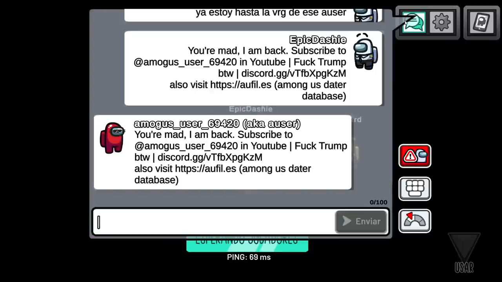

# Among Us hack
Esto es una evaluación sobre una persona a la que hackeó Among Us y entraba a salas dentro del juego.  
Simplemente acá se mostrará el respectivo resultado de una breve investigación.

# ¿Qué fue lo que pasó? (Si ya sabes qué pasó, ignóralo)
El 18 de Junio del 2026, un usuario llamado **Epic Dashie** subió un video a la plataforma YouTube titulado "Hackearon Among Us".  
En el video se puede ver que efectivamente un usuario ha hackeado el juego en sí y entra a salas. En el momento donde entra a una sala, los sonidos del lobby se desaparecen (algunos no) y el chat al envíar un mensaje, no se envía con el servidor.

# El video (Epic Dashie)
En video de donde me enteré fue [https://youtu.be/LRmpfeXGTHI](https://youtu.be/LRmpfeXGTHI) y de ahí es donde ví varias cosas.  
En el video de muestra de que el usuario que graba, envía lo mismo a lo que el atacante dijo, como se muestra en la captura de abajo.

Esto puede significar que lo que usa el atacante, envía datos no reales para hacer creer al servidor que esa persona ha dicho lo que se muestra arriba. Y si los servidores de Among Us no tienen cifrado, pues ahí está peor el asunto.

# Investigación del mensaje
En el mensaje se ven enlaces y el usuario del canal de YouTube del atacante.  
Lo primero es el canal de YouTube. ([https://www.youtube.com/@amogus_user_69420](https://www.youtube.com/@amogus_user_69420))

El canal contiene 5 videos. 3 videos largos y 2 streams.  
El último video largo se llama `my last attack (this time agaisnt daters i guess)`. Y como dice, es su **último ataque** pero con algo en particular. Algo que tiene que ver **con citas**.
___
Siguiendo, con los enlaces que lleva el mensaje en Among Us, ignorando el insulto a Trump, hay un enlace de invitación a un servidor de Discord. No he entrado a esa invitación.

Luego sigue [https://aufil.es](https://aufil.es) que **es una URL simplificada** para ser más corto. Como sospecho que podría tener un recolector de IP y/o recolector de datos del navegador, les doy la URL final: [https://au.tntaddict.net/aufiles](https://au.tntaddict.net/aufiles)

Dicha página es una base de datos pública con supuestos "acosadores y/o depredadores de menores". En la base de datos se muestra:
- El usuario
- El código de amigo
- La plataforma en la que juega
- Otros datos más

Algunos datos aparecen en blanco.

# Último recurso
El último recurso lo encontré en un enlace a un repositorio de GitHub: [https://github.com/TNTaddicted/aufiles/](https://github.com/TNTaddicted/aufiles/).  
Es un mensaje de parte del atacante (que se conoce como TNT Addict por alguna razón desconocida) sobre la moderación de Among Us.

# Final
Después de todo, nos damos cuenta (por un video) que usa un Mod Menu (menú de mods/hacks) llamado Stickomenu, que según fuentes que tengo de confianza, cuando Among Us se convirtió de la noche a la mañana en el juego más popular del planeta gracias a streamers de Twitch y creadores de YouTube, millones de personas buscaron formas de modificar el juego. En esa época, los mods y mod menus explotaron en popularidad. Los jugadores buscaban herramientas para gastarle bromas a sus amigos en salas privadas o, desafortunadamente, para hacer trampas en salas públicas.

A finales de 2021, Innersloth introdujo de forma oficial los roles en el juego (Científico, Ingeniero, Cambiaformas, etc.). Esto revivió el interés por el título, y herramientas como SickoMenu ganaron mucha fama porque se actualizaron rápido para permitir a los usuarios "revelar" en secreto los roles ocultos de los demás jugadores desde el primer segundo de la partida.

Con el paso del tiempo, el juego base estabilizó su cantidad de jugadores y la "fiebre" masiva pasó. Además, Innersloth mejoró sus sistemas antitrampas y cambió el motor de código del juego en varias ocasiones, lo que obligaba a los creadores de SickoMenu a actualizar el código constantemente o causaba que los usuarios tuvieran que "bajar la versión" (downgrade) de su juego para poder seguir usándolo.
___

  Investigación empezada el 27 de junio y terminado el 29 de junio. 2026.  
  [Página principal](https://elmichiyt.github.io/?utm_source=Post&url_medium=footerlink)